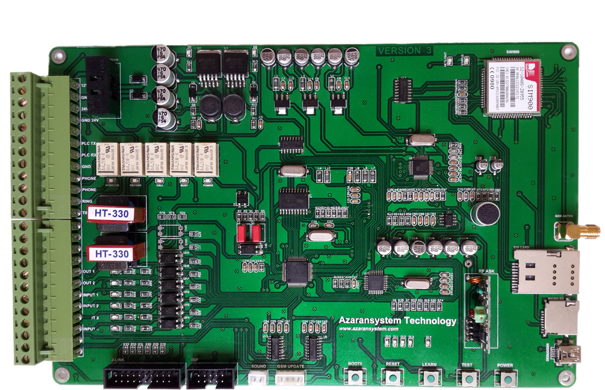
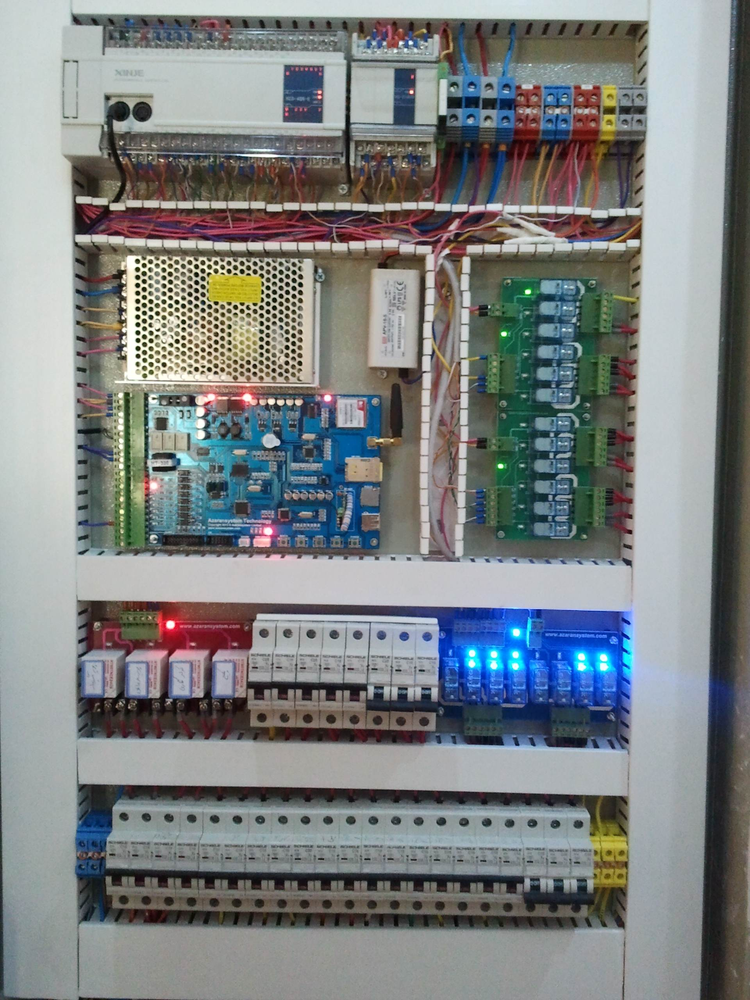
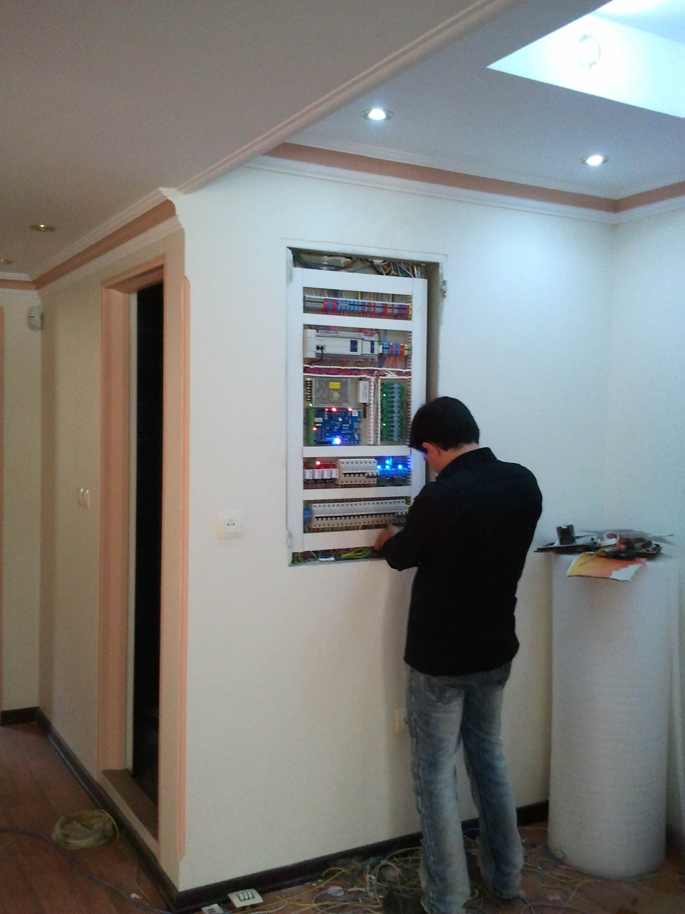

## SmartHome

## STM32F103RBT6
* Main Processor
* Debugger Serial Port
* PLC (Programmable logic controller) Serial Port Connection
* FAT File System read sound voices 
* Connect To MT8888C Process 
* 

## ATmega8A-AU
* #### Handel PT2264 
   - PT2264  is a remote control encoder utilizing CMOS. Technology. It encodes data and address pins into a serial coded waveform suitable for RF modulation.

## SIM900
* #### Send SMS 
   - Send Notification to users
   - Send alarm security
   - Send alarm 
 
* #### Recieve SMS
   - Receive Command of user

## MT8888CS
* The MT8888C is a monolithic DTMF transceiver with
call progress filter. It is fabricated in CMOS technology
offering low power consumption and high reliability. 

## VS1003
* MP3/WMA AUDIO CODEC: Ring to phone and play mp3 file for user, for example ring and play security sound

## MAX232DR
* Conectin Between STM32F103 <---> PLC
* Conectin Between STM32F103 <---> SIM900
* Conectin Between STM32F103 <---> Debuger

## PT2264
* PT2264 is a remote control encoder utilizing CMOS. Technology. It encodes data and address pins into a serial coded waveform suitable for RF modulation.

  

  

  

## License 

This software is licensed under the MIT License. See the [license file](LICENSE) for details.  
